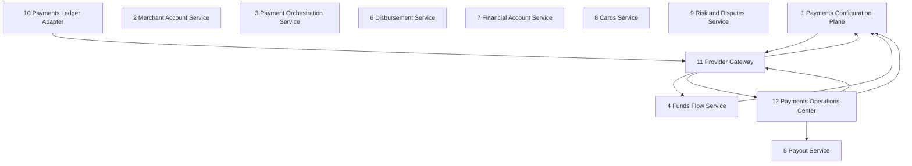

# Payments bounded contexts — ownership and dependencies

PAY-020-001. Bible §4 names twelve bounded domains for payments. This document
says, for each of them, **who owns it in this repository and what it actually
depends on** — and, for the seven that have no code at all, says that instead of
describing an intention as though it were a component.

Everything below is checked by
`tests/architecture/pay-bounded-contexts.test.mjs`, which reads Bible §4 for the
twelve names, opens every path cited here, and **recomputes the dependency graph
from the import statements** rather than trusting the diagram. A diagram nobody
recomputes is a drawing of what somebody believed on the day they drew it, and
this repository already carries the cost of one of those: `modules/index.ts`
cited a served-routes check that compared two hand-written lists.

## 1. What exists, and what does not

Seven of the twelve contexts have code. Five have none. That is the honest
reading and it is not a gap list — four of the five are contexts Tenure has
decided not to build (Bible §2: Tenure is not an issuer, not a bank, not a
custodian of funds, not the KYC decision owner), and their registry leaves are
`UNSUPPORTED` rather than `PLANNED`.

Where a context has code, none of it moves money. `packages/payments` declares
no dependencies, exports no write verb, and every registry leaf is `PLANNED` or
`UNSUPPORTED`, so what follows describes a decision layer with an evidence
inbox, not a payment system.

| # | Bounded context | Status | Owning code |
| --- | --- | --- | --- |
| 1 | Payments Configuration Plane | partial | `packages/payments/src/capability-registry.ts`, `packages/payments/src/eligibility.ts`, `packages/payments/src/prohibited-claims.ts`, `apps/web/src/app/(app)/admin/payments/page.tsx` |
| 2 | Merchant Account Service | absent | — |
| 3 | Payment Orchestration Service | partial | `packages/payments/src/payment-order-state.ts` |
| 4 | Funds Flow Service | partial | `packages/payments/src/funds-flow.ts`, `packages/payments/src/charge-model.ts`, `packages/payments/src/liability.ts`, `packages/payments/src/responsibility.ts`, `apps/web/src/app/(app)/admin/payments/actions.ts` |
| 5 | Payout Service | partial | `packages/payments/src/payout-commands.ts` |
| 6 | Disbursement Service | absent | — |
| 7 | Financial Account Service | absent | — |
| 8 | Cards Service | absent | — |
| 9 | Risk and Disputes Service | absent | — |
| 10 | Payments Ledger Adapter | partial | `packages/payments/src/posting.ts`, `packages/payments/src/balance-transactions.ts`, `apps/web/src/lib/finance.ts` |
| 11 | Provider Gateway | partial | `packages/payments/src/gateway.ts`, `packages/payments/src/api-version.ts`, `packages/payments/src/webhook.ts`, `packages/payments/src/external-reference.ts`, `apps/web/src/app/api/payments/provider-events/route.ts` |
| 12 | Payments Operations Center | partial | `packages/payments/src/refusal.ts`, `packages/payments/src/movement-commands.ts`, `packages/payments/src/limits.ts`, `packages/payments/src/financial-identifiers.ts`, `packages/payments/src/high-risk-actions.ts` |

What each of the seven that exist actually does, as against what Bible §4 asks of
it:

* **1. Payments Configuration Plane.** Has the capability registry, the
  eligibility simulation and the prohibited-copy rules, and an admin surface
  that records a funds-flow decision. Does **not** have merchant/legal-entity
  mapping or provider connection — those belong to context 2, which does not
  exist.
* **3. Payment Orchestration Service.** Has the canonical payment order and
  attempt state machines (PAY-060-001) and the reader that turns a provider
  event into an OBSERVATION rather than a transition. Nothing can take a
  payment, so there is no order to run through the machine yet: what exists is
  the vocabulary an order would be described in, the table saying which moves
  are legal, and the rule that a client redirect, a synchronous API response, an
  email and elapsed time are never final settlement. It orchestrates nothing.
* **4. Funds Flow Service.** Decides a charge model and a funds flow from the
  responsibility matrix and refuses one that shifts liability to Tenure without
  a pinned approval. Decides only: there are no charges, transfers, splits or
  reversals to route, because nothing can execute.
* **5. Payout Service.** Has the five outbound commands Bible §11 refuses to
  let anybody collapse into one verb — settlement payout, balance transfer,
  outbound payment, refund, disbursement — each with its own state machine, its
  own counterparty and its own answer to whether a bank can hand the money back
  (PAY-090-001). No payout can be requested, approved or released: executing any
  of them is refused outright by `packages/payments/src/refusal.ts`. This is the
  taxonomy, not the service.
* **10. Payments Ledger Adapter.** Posting templates with balanced-entry
  validation, and provider balance-transaction ingest that can tell a redelivery
  from a correction. The universal-journal posting itself is `@tenure/finops`,
  reached through `apps/web/src/lib/finance.ts`.
* **11. Provider Gateway.** The provider-neutral port, the pinned API version,
  webhook signature verification and deduplication, and qualified external
  references. It holds **no provider SDK and makes no network call** — the event
  route records evidence and stops.
* **12. Payments Operations Center.** The refusal engine, the movement limits,
  the financial-identifier protection that decides how much of a card or bank
  number a purpose has earned, and the evidence package a high-risk action has
  to carry. No queues, dashboards or incident tooling; what exists is the
  control that says a request may not proceed and names the queue that would
  own it, plus the two PAY-200 controls that govern what an operator may see
  and what a consequential action must record. The evidence package here is an
  AUDIT evidence package for an action — not the dispute evidence package
  context 9 would own, which still does not exist.

The five absent contexts, and why each is absent rather than pending:

| # | Context | Why there is no code |
| --- | --- | --- |
| 2 | Merchant Account Service | No connected-account, representative or requirements model exists. `ConnectedAccountConfiguration` in `packages/payments/src/charge-model.ts` is an INPUT to a decision, supplied by the caller — not a stored account. |
| 6 | Disbursement Service | Same refusal, for vendor and contractor instructions. |
| 7 | Financial Account Service | Bible §2: Tenure is not a bank or custodian. `financial-account.embedded` is `UNSUPPORTED`. |
| 8 | Cards Service | Bible §2: Tenure is not an issuer. `cards.physical-and-virtual` is `UNSUPPORTED`. |
| 9 | Risk and Disputes Service | No dispute case, evidence package or hold exists; PAY-120-* is open. |

## 2. The dependency graph, module by module

One row per module in `packages/payments/src`, its context, and every module it
imports. `index.ts` is deliberately absent: it is the package's published
surface and imports everything by construction, so its edges describe an export
list rather than a coupling. Test files are excluded for the same reason — a
test may reach anything.

**A module added to `packages/payments/src` must be added here**, or the guard
fails naming it. That is the intended cost: an undocumented module is exactly
what "publish ownership and dependency diagrams" is asked to prevent.

| Module | Context | Imports |
| --- | --- | --- |
| `api-version` | Provider Gateway | `external-reference` |
| `balance-transactions` | Payments Ledger Adapter | `external-reference` |
| `capability-gates` | Payments Configuration Plane | `capability-registry` |
| `capability-registry` | Payments Configuration Plane | `api-version`, `capability-gates` |
| `charge-model` | Funds Flow Service | `capability-registry`, `funds-flow`, `responsibility` |
| `eligibility` | Payments Configuration Plane | `capability-registry` |
| `external-reference` | Provider Gateway | — |
| `financial-identifiers` | Payments Operations Center | — |
| `funds-flow` | Funds Flow Service | `capability-registry`, `eligibility`, `responsibility` |
| `gateway` | Provider Gateway | `api-version`, `external-reference`, `prohibited-claims`, `refusal`, `responsibility` |
| `high-risk-actions` | Payments Operations Center | — |
| `liability` | Funds Flow Service | `charge-model` |
| `limits` | Payments Operations Center | — |
| `movement-commands` | Payments Operations Center | `payout-commands`, `refusal` |
| `payment-order-state` | Payment Orchestration Service | — |
| `payout-commands` | Payout Service | — |
| `posting` | Payments Ledger Adapter | — |
| `prohibited-claims` | Payments Configuration Plane | — |
| `refusal` | Payments Operations Center | — |
| `responsibility` | Funds Flow Service | — |
| `version-watch` | Payments Operations Center | `api-version`, `capability-registry`, `refusal` |
| `webhook` | Provider Gateway | `external-reference` |

## 3. The context diagram

Derived from the table above by mapping each module edge onto its context and
dropping the ones that stay inside a context. The guard recomputes this set and
requires the arrows below to be exactly it — no missing edge, and no arrow that
the code does not justify.

Nine edges, and the shape they make is worth stating plainly:

* **Almost everything points at 1.** The Configuration Plane holds the
  capability registry, and the Provider Gateway, the Funds Flow Service and the
  Operations Centre all ask it what Tenure has approved before deciding
  anything. Availability is one answer rather than a negotiation between planes.
* **1 → 11 is the one arrow that points back, and it is narrow.** The registry
  reads the pinned provider API version, and nothing else, because PAY-010-003
  makes a leaf's certification a claim ABOUT a provider API version: a leaf
  reviewed under a version this build does not run resolves to `UNSUPPORTED`
  rather than keeping its stored state. The registry does not import the
  gateway, the webhook verifier or any client — `api-version.ts` holds a
  constant and two pure functions, which is why the edge does not make the
  Configuration Plane depend on a provider call.
* **11 → 4 and 11 → 12** are the gateway asking the funds-flow matrix who the
  merchant is, and the operations centre whether a movement may proceed at all.
  A port that decided either for itself would be the platform acquiring a
  liability at the edge.
* **10 → 11** is the ledger adapter keying provider records by a qualified
  external reference. The arrow does not reverse: the gateway never reads the
  ledger, so an evidence record cannot be shaped by what has already been
  posted.
* **12 → 1 and 12 → 11** are the provider version and feature watch
  (PAY-010-007) reading what Tenure has certified and what the build is pinned
  to, so it can raise a review task per leaf. Both arrows are reads. There is no
  arrow out of the watch into anything it could change, which is the property
  the requirement is actually about: a watcher that could write would adopt a
  provider version at 3am with no approver in the loop.
* **12 → 5** is the movement classifier asking the payout taxonomy which of
  Bible §11's five verbs an external movement is. The arrow points that way and
  not the other: the taxonomy does not know what a request is, and the
  classifier does not define what a payout can do.
* **The five contexts with no code have no edges.** They are drawn because
  Bible §4 names them and a diagram that omitted them would read as a system
  with fewer parts than it has.

## 4. What this document cannot tell you

The guard compares this file to the import graph. It cannot check that a module
is in the *right* context — `responsibility.ts` is placed in the Funds Flow
Service because the eight axes decide a flow's liability, and an equally
defensible reading puts it in the Merchant Account Service, which does not
exist. It cannot check the prose in §1. And a green run says nothing about
whether the five contexts that exist do what Bible §4 asks of them; every one of
them is partial, and §1 says in what way.
